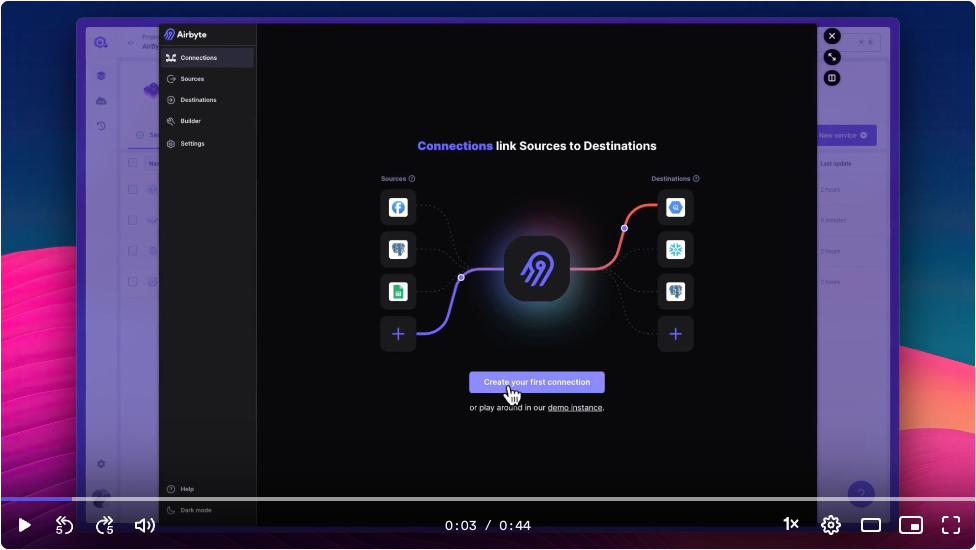

# Deploy Airbyte in 5 minutes on Kubernetes with Qovery

[Airbyte](https://www.airbyte.com) is an open-source data integration platform that syncs data from applications, APIs, and databases to data warehouses, lakes, and other destinations. It is a modern and easy-to-use platform that helps you replicate your data in minutes.

In this tutorial, you will learn how to deploy Airbyte on Kubernetes with Qovery in 5 minutes.

> This tutorial is related to [this forum thread](https://discuss.qovery.com/t/help-setting-up-airbyte-and-using-kubernetes-secrets/2848)

## Why Qovery with Airbyte?

TLDR;
- Time to install EKS production ready cluster: 2 minutes setup
- Time to install Airbyte: 3 minutes
- No EKS / GKE / Kapsule knowledge and maintenance required (Qovery takes care of it)
- Secure access via Basic Auth and Built-in authenticated port forwarding

Watch the video below to see how easy it is to deploy Airbyte on Kubernetes with Qovery:

[](https://www.loom.com/share/2052bc83b0cb456fab20a5b25a6389f2)

Qovery is a developer-friendly platform that allows you to deploy your applications on any cloud provider in just a few clicks. It is a great platform for developers who want to focus on building their applications without worrying about the infrastructure.

## Prerequisites

Before you start, you need to have the following:

- A [Qovery account](https://console.qovery.com)
  - Create a Kubernetes Cluster in Qovery
- [Terraform](https://developer.hashicorp.com/terraform/tutorials/aws-get-started/install-cli) on your local machine

## How to deploy

1. Clone this repository
    1. Adapt the [airbyte-values.yaml](airbyte-values.yaml) file to your needs (optional)
2. Run `terraform init`
3. Set the [following environment variables](variables.tf):
    1. `TF_VAR_qovery_api_token` - Your Qovery API token
    2. `TF_VAR_qovery_organization_id` - Your Qovery organization ID where to deploy Airbyte
    3. `TF_VAR_qovery_project_id` - Your Qovery project ID where to deploy Airbyte
    4. `TF_VAR_qovery_cluster_id` - Your Qovery cluster ID where to deploy Airbyte

```bash
export TF_VAR_qovery_api_token="your_qovery_api_token" \
TF_VAR_qovery_organization_id="your_qovery_organization_id" \
TF_VAR_qovery_project_id="your_qovery_project_id" \
TF_VAR_qovery_cluster_id="your_qovery_cluster_id"
```

4. Run `terraform apply`
5. [Connect to your Qovery project and environment](https://console.qovery.com), you should see an environment called `airbyte-production` within your project.
6. Deploy your `airbyte-production` environment

## How to remove

1. Run `terraform destroy`

## How to update

1. Update the Airbyte configuration in the `airbyte-values.yaml` and `main.tf` files
2. Run `terraform apply`
3. Redeploy the application in Qovery

## Basic Authentication

As mentioned by Airbyte:

> Airbyte Kubernetes Community Edition does not support basic auth by default. To enable basic auth, consider adding a reverse proxy in front of Airbyte.

But luckily, [Qovery supports basic authentication](https://hub.qovery.com/docs/using-qovery/configuration/advanced-settings/#networkingressbasic_auth_env_var) out of the box. You can enable basic authentication for your `Airbyte Web App Proxy` instance by following the steps below:
1. Generate password hash with `htpasswd`:
```bash
$ htpasswd -n <username>
New password:
Re-type new password:
username:$apr1$jpwW4vG9$fwbzWBgRqARzNX93plDq20
```
2. Set `TF_VAR_qovery_airbyte_web_app_proxy_basic_auth` environment variable with the generated password hash:
```bash
export TF_VAR_qovery_airbyte_web_app_proxy_basic_auth="username:$apr1$jpwW4vG9$fwbzWBgRqARzNX93plDq20"
```
3. Run `terraform apply`
4. Redeploy the `Airbyte Web App Proxy` in Qovery

## Port Forwarding

Qovery provides a built-in authenticated port forwarding feature that allows you to access your services securely. You can access your Airbyte instance by following the steps below:
1. Install the Qovery CLI by following the instructions [here](https://hub.qovery.com/docs/using-qovery/cli/install/)
2. Run the following command to forward the Airbyte service to your local machine:
```bash
qovery port-forward -p 8000:80
```
3. Access Airbyte by visiting `http://localhost:8000`